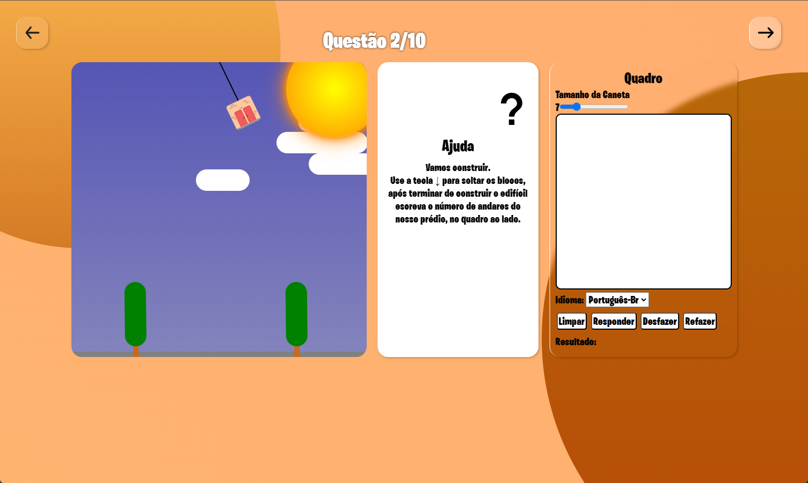

<h1 align="center">
    
    
Conceito de Projeto da plataforma Contei.

</h1>

# Sobre 
 Uma plataforma idealizada para ajudar pessoas, em especial crianças, que sofrem com o transtorno neurológico da discalculia, que é a dificuldade de manipular números em diversos aspectos do cotidiano, a plataforma contei seria uma interface que tinha de exercitar a manipulação de números por meio de minigames e escrita de números em um painel digital.

 <h2>
    
 </h2>

# Minigames

Por se tratar de um prototipo apenas para ilustração e apresentação da ideia, o contei conta apenas com 2 dois MiniGames desenvolvidos usando JavaScript, que estimulam a contagem de elementos na tela, o usuário deverá escrever o elemento no quandro ao lado, que será interpretado por uma Inteligencia Artificial que parabenizará o usuário caso acerte, ou dará dicas caso erre, ambos os jogos relacionados à discalculia gráfica.

Mova a abelha com as teclas de seta para colher os pólem das flores.

Ou construa um prédio sem derrubar os blocos.

# Objetivo

O objetivo deste projeto é criar uma ferramenta capaz de registrar melhoras ou pioras nos casos de discalculia, e por meio destes registros ajudar especialistas no assunto na tomada de decisão.

# Equipe 
Este Projeto foi realizado na discliplina de projetos 3 no curso de engenharia da Computação na UFPA com os alunos: 

    - João Flávio
    - Lucas Lima
    - Arthur Paes
    - Eduardo Fernandes

Este projeto está online no meu github pages, para acessar clique <a href="https://imFernandes23.github.io/Contei-concept/html/index.html">aqui</a>.

